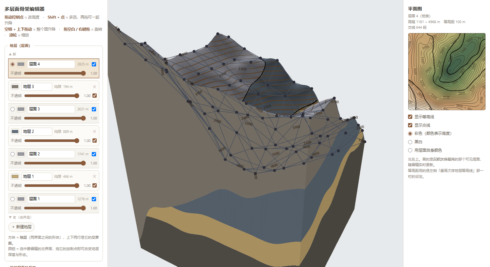

# GeoStructure Builder

> 手工「捏」出任意地质界面：拖控制骨架 → 得到光滑曲面。
> 纯浏览器运行，零依赖，不联网。
>
> *A browser-based 3D editor for geological surfaces: sculpt a control skeleton, get a smooth surface. No dependencies, works offline.*

把 `index.html` 下载下来双击就能用。不需要安装任何东西，不需要服务器。

**在线版：https://luthetin.github.io/geostructure-builder/**（由 GitHub Pages 托管）

> **相关链接**
> - 🌐 在线应用：<https://luthetin.github.io/geostructure-builder/>
> - 💻 代码仓库：<https://github.com/luthetin/geostructure-builder>
> - 👤 作者个人网站：<https://luthetin.github.io/> ｜ [这个项目的介绍页](https://luthetin.github.io/geostructure-builder.html)



*左：地层柱（4 个交界面夹出 3 个地层）　中：三维视图（地层是实体，四周切面实心，最下面接基底构成封闭块体）　右：实时平面图*

---

## 它在解决什么问题

研究地层界面（地层面、不整合面、断层面）时，常见做法是拿几何软件摆一个抛物面当地形、摆一个平面当地层，再求交线。这条路走得通，但很快会撞墙：

- **地形只能是最简单的形状。** 想换成真实山脊、沟谷、台地，就没有解析式可摆了。
- **界面也只能是平面。** 想加个褶皱、错个断层，参数化就崩了。

本工具换一个提法：**界面不是算出来的，是你捏出来的。**

用一张粗糙的**骨架面**（控制网格）去描述界面，程序用三次样条把它插值成光滑曲面。想把地形改成什么样，拖控制点就行 —— 山脊、沟谷、穹隆、鞍部，都能捏出来；骨架之间的拓扑关系天然支持任意复杂的形态。

而**地层是有厚度的实体**，不是没有厚度的面：两个交界面之间夹出来的那块形体就是地层，程序把它画成真正的实体（顶面 + 底面 + 四周侧壁），厚度看得见。

---

## 快速上手

| 操作 | 效果 |
|---|---|
| 拖控制点 | 改该点高度（作用于选中的交界面） |
| **Shift** + 点控制点 | 多选（再拖任一选中点即可整组升降） |
| **空格** + 上下拖 | 整个交界面升降（形不变） |
| 拖空白 / 右键拖 | 旋转视角 |
| 滚轮 | 缩放 |

左侧面板是**地层柱**：自上而下「新 → 老」，方块是地层（可改颜色/透明度/显隐），方块之间的横条是交界面（点圆钮选中它，也能改颜色/透明度）。右侧是实时平面图。

---

## 地质模型

```
ifaces[0..n-1]   交界面，自下而上排好序，各带一套骨架
strata[0..n-2]   strata[k] = ifaces[k] 与 ifaces[k+1] 之间的【形体】
```

**n 个交界面 ⇒ n−1 个地层** —— 两个交界面之间的层即为地层。

- 新建地层 = 在最上面加一个交界面（地表）+ 一个新的地层体
- 删除地层 = 去掉它的上交界面，让它与相邻地层并成一个
- 颜色与透明度挂在**地层体**上；交界面也有自己的颜色与透明度

---

## 功能

**手机 / 平板**
- 窄屏（≤820px）时左右两块面板收成**抽屉**：左上角一个 **☰**，点一下开左面板、再点换右面板、再点全收起；点画布或遮罩也会收起。画布始终铺满屏幕
- 触屏手势：**单指拖控制点**改高度、**单指拖空白**旋转、**双指捏合**缩放（以两指中心为锚点）
- 触屏没有 Shift 与空格，所以面板里多了两个开关：**多选**（代替 Shift）与**整体升降**（代替空格），两者互斥
- 触摸设备上按钮、滑块、行高统一放大（`@media (pointer:coarse)`），点得中
- **初始相机距离按画面宽高比自适应**：固定 `图幅×1.95` 是按横屏调的，手机竖屏水平视野只有一半左右，模型会横向溢出 —— 竖屏时按水平视野重算（实测桌面 7800 → 手机竖屏 13981）**地层柱可折叠**
- 每个交界面行 / 地层行左侧一个小三角：收起只留第一行（颜色、名称、厚度），展开才显示第二行（不透明度、显隐）—— 预设2 有 22 层，不收起来面板两千多像素高
- 面板顶部一组「**全部收起 / 全部展开**」；字段集标题（如「地层（层面）」）也能点，整个区块收起来
- 折叠状态记在 `S.folded`（键形如 `i3` / `s2`），列表因改颜色等原因重建后仍然记得；它是界面偏好，**不写进存档****性能（22 个界面的预设2 实测）**

原来每动一下都要把整副模型重算一遍，一分钟都动不了几帧。三处改动：

| | 改前 | 改后 |
|---|---|---|
| 一次完整重建 | 1207 ms | ~270 ms |
| **拖动中的一帧** | **~1200 ms** | **133 ms** |
| buildStratum × 21 | 468 ms | 162 ms |
| computeIfaceFields | 304 ms | 69 ms |

- **透明场换成后缀和**：`S_i = z_i − soften·log(Σ_{j>i} e^(−z_j/soften))` 里的求和是**后缀和**，从最上面一个界面往下递推就 O(n)，而原来是每个界面各扫一遍全部界面 = O(n²)。同一趟还把岩体那条 `C_k` 顺手算出来（它要的就是同一个后缀和）。
- **只重建真的变了的东西**：给每张界面的曲面求值记一个**代号**，只有控制点真的动了才 +1。地层网格与界面薄面靠代号判断能不能整块复用 —— 拖一个界面时，只有夹着它的那一两层形状会变。代号变了才重建，旧网格由替换方负责释放（否则显存泄漏）。
- **拖动期间只算形状**：交线、等高线、平面图这些贵的留到松手时补一次完整重建（`endInteract()`）。⚠ **透明场不在此列**：它是这个程序的规则本身，拖过一个界面必须立刻变透明 —— 一开始把它也省掉了，真机上表现就是"层序透明规则失效"（拖过去不变透明），所以又改回每帧都算。
- 另外：手机/平板的画布像素比封顶 1.5（手机上填充率通常才是瓶颈）。**深色界面**
- 整套配色集中在 `:root` 的 CSS 变量里，改配色只动那几行；强调色是青（`--accent`），次强调是琥珀
- **3D 视图的清屏色必须等于 `--bg`**（`render()` 里的 `clearColor`），否则画布和面板会有色差
- 换深色时容易漏的是**画在画布里的东西**：3D 里的骨架线（改成青色）、控制点手柄（改成近白）、等高线数字（改成亮色 + 暗描边）、平面图（整块保持浅色，在深色界面里像一张打光的图纸）**内置预设**
- 面板顶部有「预设」下拉，可选内置示例模型（**预设1**：19 个交界面 / 18 个地层；**预设2**：22 个交界面 / 21 个地层）。选中即载入，名称、颜色、显隐、等高距、视角一并恢复
- 预设以 `<script type="application/json" class="preset" data-name="…">` 的形式**内嵌在 HTML 里**，所以**离线单文件也能用**（不依赖 fetch，`file://` 直接打开照常工作）
- 仓库 `presets/` 目录放了同名源文件；**改预设时两处一起改**（内嵌的那份是运行时真正读的）**模型命名**
- 面板最上面可以给当前模型起名：名字会写进页面标题、信息栏，**存进存档文件**，下载的 `.json` / `.png` 也用它做文件名（文件名里的非法字符自动换成 `_`）
- 旧格式存档（只有"层面"、没有名称字段）照样能打开，名字留空显示"未命名模型"

**默认勾选**（一开就是干净的地质体，要看别的再自己打开）

| 默认开 | 默认关 |
|---|---|
| 控制点手柄、交界面交线（黑色）、显示交界面、沉积次序透明规则 | 骨架线框、骨架面填充、骨架透视、显示地面、地表等高线、等高线标注、平面图等高线与交线 |

**右侧平面图**（三种模式）

| 模式 | 画什么 |
|---|---|
| 彩色 | 高程配色（低→高） |
| **黑白** | **纯白底 + 黑线**：高度完全不参与着色，只有等高线与交线（老版是灰阶打底，黑线压在深灰上看不清） |
| **用层面自身颜色** | **表露面的露头带**：逐像素取"地表之下压着的那一层"的颜色，和 3D 里那条色带是同一套判据（同一个函数 `exposedBandXYZ`），条带边界处用 3×3 取众数，缩下去也是硬的 |

交线**默认只画露头迹线** —— 与地表面相交的那些曲线，它们正好就是露头带的分界（3D 里那条色带的边界）。埋在下面的两个界面互相穿插的交线在地表上根本看不到，画上去就是一坨，所以默认不画；要看就关掉「只画露头迹线」那个开关。实测某个四界面模型：露头迹线 536 段、埋在下面的 108 段。**等高线**
- 等高距滑块 5 ~ 1000 m；旁边有「**自动**」：按当前地表起伏挑一个整的等高距，让线数落在 10~15 条附近（构造地质学的模型从几十米到几千米都有，固定默认值总有一头不合适）
- 实测：起伏 60 m → 5 m ／ 起伏 300 m → 25 m ／ 起伏 3800 m → 300 m

**骨架与曲面**
- 控制点排在平面整数格上，连成正方形、每格加一条对角线分成两个三角形 —— 就是骨架面
- 两种曲面：**插值型（Catmull-Rom）**曲面严格穿过每个控制点；**逼近型（三次 B 样条）**曲面被控制网拉着走
- 分辨率 5×5 ~ 13×13，切换时形状保留（在新控制点位置重采样旧曲面）
- 一键生成：谷地 / 丘陵 / 平拉 / 随机 / 平滑一次

**地层实体**
- 每个地层画成实体：顶面 + 底面 + 四周侧壁，绕序一律朝外
- 渲染分两趟（**所有**背面先画且不写深度，再画所有正面）—— 一个地层一个地层地画是不行的：后面地层的背面会先把深度写掉，把前面地层本该透出来的背面挡在门外，看上去就是"有的地层一半是透明的"
- 侧壁是"厚度看得见"的关键 —— 没有它，地层还是一片纸；而且侧壁永远是实心的（见下）

**沉积次序透明规则**

> 某处若有**更高的交界面压在下面**，该处这个交界面就透明；
> 而**地层实体只在它自己尖灭掉（厚度为负）的时候才不画** ——
> **一个界面之上只出现层序比它高的岩层**（面与剖面都是）；地表面本身永远铺满，颜色按露头带一层一层地换。

**规则只管「交界面那张面」，地层实体只管「自己还在不在」。** 这两件事分开，是这一节最要紧的一条 —— 之前把它们混在一起，导致两个诉求互相打架，怎么调都是一边好一边坏。

### ① 交界面（那张面）

```
S_i(x,y) = min over j>i of ( z_j − z_i )    更年轻的界面压在它下面
S < 0  →  丢弃该片元
```

**只有这一条**：存在比它年轻的界面在它下面，这张面就不画。

于是两张层面相交时**只判老的透明**：次序低的那张让位，次序高的那张照常显示 —— 相交范围内一定有一张看得见。最上面那张（地表面）没有更年轻的界面，所以**永远不被判透明**。

> 曾经还有对称的一半「更老的压在它上面也透明」。那是为了压住**最上面那张界面的多余薄面**：地表面没有更年轻的界面，规则不触发它，于是它那张薄面会一直盖在露头带的颜色上。但地表面本来就不需要多余的薄面 —— 它的面就是地表那个盖子本身（永远画、颜色按露头带），所以那张薄面去掉之后，这一半也就没有存在理由了。

用**连续的有符号场**而不是逐顶点 0/1 开关：在过零处丢弃片元，透明边界就**精确落在两个面的交线上**。改成逐顶点开关的话，边界只能落在三角形顶点上，会呈网格状锯齿，正好把画在那条边界上的交线啃出缺口。

这个 `min` 也用**软最小值**（和岩石那条 `C_k` 同一个道理、同一个尺度）：硬 min 在"最小值换主人"处会折一下（实测这个模型上每个界面换 75~217 次），丢边界跟着拐折。软 min 恒 ≤ 硬 min，所以只会多透明、绝不会多显示。

### ② 岩石：一个界面之上只出现层序更高的岩层

**面和剖面用同一条规则**：

```
C_k(x,y) = 比本层年轻的界面里【最低】的那个 —— 用【软最小值】算，不用硬 min
顶面 / 底面 / 四周侧壁的场 = min( C_k − 顶点高程 , 本层厚度 )；为负就不画
```

- 高过 `C_k` 的岩体**不显示** —— 这就是"不该显示的地层又显示了"的反面
- 本层尖灭（厚度 < 0）的也不画
- **唯一例外：最上面那个界面的顶面是「地表面本身」**，它不是岩层 —— 面永远画，颜色按露头带（见下）

**副作用（已知且无法两全）**：剖面上会留下空档 —— 宽的是洞（占总高约 16%），细的是缝（1~10.7 m），细缝看上去就是锯齿。这些空档的位置上所有岩层都在某个更年轻的界面之上，按规则谁都不许显示。想填满剖面就得显示不该显示的岩体，两者互斥；本项目选择遵守规则。

（曾经把剖面改成"按岩体画满"，剖面上确实没有洞也没有缝了，但那些岩体在地表之上 —— 也就是"不该显示的地层又显示了"，所以改回来了。）

### ③ 地表面：永远铺满，颜色按露头带

**地表面 = 最上面那个界面**（不是岩层）。它永远整片画出（9409/9409 个网格点），颜色取**地表正下方压着的那一层**：

```
取【地表高程正好落在它区间里】的那一层（z_k ≤ 地表 ≤ z_{k+1}），从上往下找第一个；
一层都不落在里面（地表在所有层的底面之下）就是基底
```

于是俯视就是**一层一层的露头带**，带与带的分界**只可能**落在界面与地表的交线上。实测（截图那个真实模型）：

| 带的颜色 | 柱数 |
|---|---|
| 地层2 | 4460 |
| 地层1 | 2814 |
| 地层0 | 953 |
| 基底 | 1182 |
| **铺不满（洞）** | **0** |

带分界 606 条。岩石那条规则让上面几层在该露出来的地方消失，地表面照画、只是换成露出来那层的颜色 —— 所以俯视既没有洞，也严格按规则。

**带与带的颜色边界是锐利的，而且精确落在交线上**：颜色不在顶点上插值，而是把**跨带的那些格子沿真实交线切开**，每一块整块同色。

- 每个格点带着【地表高程 + 各界面高程】。用一个界面的场 `g = z_k − 地表` 把格子（凸多边形）切成 `g≥0` / `g≤0` 两块，交点在格边按端点线性插值；对所有真正穿过这一格的界面各做一遍 —— 得到的就是"每一块都属于同一个带"的划分。
- 每块用重心定带号（**带号 = 地表之下有几个界面**，0 = 基底），整块同色、顶点不共享。所以颜色边界就是那条切线本身，而切线正好落在交线上 —— 既锐利，又不会有位置偏差。
- 这些格子原本的三角形跳过不画；切开的多边形顶点追加在网格末尾，于是"顶面 0 到 SZ、底面 SZ 到 2SZ、侧壁其后"的下标约定原样不变。
- z 用**已经插值好的地表高程**，不用 `sampleSurface`：那个函数会把采样点夹回格内，贴地图边界的点会被拉偏最多一整格。

为什么不用着色器：逐顶点插值会把过渡带糊成**整整一格宽（≈42 m）**；片元里按带号查表虽然锐利，但阈值只能落在**格边中点**，实测偏出真实交线**中位 10.7 m、最大 20.6 m**；再把顶点往边界挪也只是把误差降下来（你的模型上中位 0.77 m、最大 17.69 m），因为一个顶点挨着两条跨带边时两条约束互相矛盾、只能取平均。切开几何没有这个问题 —— 边界是画出来的，不是算出来的。

实测：合成模型切开点离交线 **0.000 m**、37824 个三角形**混色 0 个**；真实模型 536 格被切开、6420 个切开顶点、38700 个三角形**混色 0 个**。

### ④ 交界面薄面：同样服从层序规则，另外带自己的颜色与透明度

除**最上面那张**之外，每张交界面都有一个独立的薄面（沿法线抬高 1.5 m，免得和地层的顶/底面 z-fighting），有自己的颜色与透明度。**调某一张的透明度，就能看清层面与层面之间的空间关系。**

**最上面那张不做薄面**：它就是地表那个盖子本身（永远画、颜色按露头带）。多做一张只会以 1.5 m 的高度浮在盖子上方把露头带的颜色盖住。

薄面**照样服从层序规则**：`S_i = min over j>i of (z_j − z_i)`，`S < 0` 的地方这片薄面不画 —— 也就是**相交处只判老的透明，次序高的那张照常显示**。

实测（那个真实模型，9409 个柱）：界面0 透明 1433、界面1 透明 2822、界面2 透明 4262、**界面3（最高次序＝地表面）透明 0**；相交 8516 处，**"两张都透明" 0 处**。

### ⑤ 颜色：每张界面只画一遍

一个界面 `iface k` 会被**上下两个地层同时当作自己的边界**：`iface k` 是地层 `k−1` 的顶面、又是地层 `k` 的底面。两个面**几何完全重合**（实测 **8227/9409 个柱上有多个面重合，最多 6 个面挤在一柱**），颜色却不一样时，就是一片 z-fighting 的重叠面 —— 透过透明的地表看下去，交线里外都糊成一个颜色。

而这两个面的**可见性恒等**：因为 `C_{k−1} = min(z_k, C_k)`，两者算出来的场是同一个表达式，永远同画同不画。所以修法很干净：

> **底面的颜色用"下面那一层"的颜色**（最下面那层的底面接基底，就用基底颜色）。

于是这张面就只有一个颜色 —— 下面那一层的顶面。透过透明的地表看下去，颜色带按交线划分，一层一层地换（实测：基底 953 柱 / 地层0 2127 柱 / 地层1 5147 柱，相邻柱颜色变化的边 **539 条**）。

**规则的分工。** 交界面那张薄面只看**它自己**的透明判据（更年轻的压在它下面）；地层实体（面与剖面）的存在性由岩石那条管。两者分开，才不会出现"本该消失的地层又出现了"或者"露出来的地层是透明的"这类互相打架的结果。

### 效果

| 位置 | 交界面那张面 | 地层实体 |
|---|---|---|
| 叠置正常处 | 不透明 | 实心 |
| 某一界面拱穿另一个 | 按规则（被压住的那张透明） | **一个面之上只有层序更高的岩层**；越界顶点 0 个 |
| 各层露头 | —— | 颜色带按交线划分，一层一层地换 |

**透明只从规则来，不从面板来。** 面板上调一个交界面的不透明度，只影响**那张面本身**；它上下两个地层的透明度各自独立，不会被带着变。想让地层透，调地层自己的滑块。这两件事必须分开：一个是"你没让我透"，一个是"地质上我本来就该透"，混在一起就没法手动控制了。
**基底与地面**
- 最下面自动长出一层**基底**：从最底下的交界面往下 `S.baseDepth`（默认 250 m），四周同样是实心侧壁
- 再加一个水平的地面/底面，于是整个模型是一个封闭的块体，像 Minecraft 的一个 chunk —— 转到底下看不会看穿
- 基底颜色、深度都可在面板上调

**交线与等高线**
- 交界面两两求交，交线画成贴在曲面上的连续红带
- **地表**（最上面的交界面）上的**构造等高线**（走向线），等高距可调，颜色/透明度可调
- 等高线数字按真正地形图的规矩：**线在数字处断开**、数字**沿线方向旋转**、**自动避让**不堆叠
- 平面图与 3D 视图共享同一套折线机制

**平面图（右侧）**
- 实时显示最高次序层面的等高线地形图，北在上
- 彩色（颜色表示高度）/ 黑白 / 层面自身色
- 可分别开关等高线与交线

**保存**
- 保存为 `.json`：含每个层面的骨架高程、颜色、透明度、次序、显隐，以及分辨率、曲面类型、视角、各类显示设置
- 导出 PNG（按画布真实分辨率，含高分屏）

---

## 地质背景

程序里的"等高线"不是随便画的等值线，是**构造等高线（走向线）**—— 线上每点高程都等于该条的标注高度，是判读产状、预测露头位置的基本工具。测试里对这一条做了逐点验证。

**高斯曲率**也能算并着色：红=穹隆（K>0）、蓝=鞍部（K<0）、灰=可展面（K≈0）—— 正是构造地质学里最要紧的三种形态。

需要注意：曲率是光滑曲面**本身**的属性，得先有光滑曲面才能算它，不能拿它来造曲面。造光滑曲面的算子是插值/逼近（本程序用样条）。所以这里的曲率是**分析显示**，不是生成手段。

---

## 技术说明

**不依赖任何库。** 渲染是手写的 WebGL（两个着色器程序、一个轨道相机、逐顶点属性），等值线是 marching squares，曲面是张量积三次样条。整个程序是一个 HTML 文件，不联网也能跑。

**交线几何为什么不按网格单元逐段生成。** 每格各做一条独立窄带的话，相邻段的"垂直方向"是各自算的，接缝处会错开 —— 每个错开就是一道缺口，连起来就是网格频率的锯齿。正确做法是先把线段**缝成折线**（网格边有唯一编号，交点天然共用），再沿折线生成**连续**窄带，每个顶点的垂直方向由前后邻点决定。测试里对此有专门断言。

**窄带必须骑在两张面之上。** 交线是两张面的交，窄带左右两侧分别落在两张面之上；只贴其中一张，另一半必然沉到另一张下面被深度测试切掉，看上去就是"带透明缺口的锯齿"。所以每个顶点取 `max(ZA, ZB)` 再抬高，且取样要和渲染网格用**完全相同的三角剖分**。

**地层的绕序必须对新。** 地层实体用两趟剔除渲染（先画背面再画正面），绕序写反就会把该看见的墙壁剔掉。顶面法线朝上、底面朝下、四周侧壁朝外，测试里逐个三角形算了几何法线来验证。

---

## 自动检验

```bash
node test/skeleton-check.js
```

用假 WebGL + 假 DOM 让程序在 Node 里完整跑起来，然后做数值断言。共 **211 项**，覆盖：

- **数学正确性**：Catmull-Rom 严格穿过控制点（误差 5.6e-8 m）；抛物面的高斯曲率与解析值 c² 相对误差 **0.000%**；穹隆/鞍部/圆柱面的曲率符号正确（圆柱面 K 精确为 0）
- **规则正确性（只管交界面那张面）**：逐点核对「更年轻的压在它下面 ⟹ 透明」等于定义（不符 0），并断言**规则确实在起作用**（不是全部不透明）。另加两条相交行为：**相交处老的那张一定透明**（次序低的让位，10767 处相交 0 例外）、**最上面那张永远不被判透明**（它是地表那个盖子）
- **地层实体的唯一判据**：逐顶点核对 `场 = C_k − 顶点高程`（不符 0/42244），并断言**画出来的顶点一律不高过 C_k**（21122 个顶点越界 0 个）
- **地表之上不许有东西**（专测"地表层上面冒出别的岩层"）：造一个中界面拱穿地表的模型，断言**地表那个盖子 9409/9409 个网格点完整**（不裁出洞）、拱穿尖灭掉的那层 96/96 柱隐藏
- **面归面、岩体归岩体**（专测之前互相打架的两个诉求）：尖灭掉的 **23 柱整层隐藏**（不会靠底面又冒出来 —— 那张共用的面不会重复画），同一张面上**露出来的那层岩体 2328 点全部实心**（看得到它的颜色），而**地表那张薄面 2328 点全部透明**（规则没失效）
- **透明只从规则来**：单独把交界面透明度调低，上下地层的透明度**一字不变**
- **交界面这条规则也用软最小值**：断言软场**恒 ≤ 硬 min**（只会多透明、绝不会多显示），且多透出来的部分落在软化带内（不超过一个网格步长 × log 界面数）
- **每张交界面都有薄面**：断言薄面网格数 = 界面数（包括最上面那张 —— 它就是地表面本身；曾经把它删掉过，结果是用户"一张层面都看不到"）
- **表露面的颜色边界是切出来的**：断言跨带格子确实被切开、**每个画出来的三角形三个顶点同色**（37824 个三角形混色 0 个；一旦退回插值就有 192 个三角形混色 —— 反证做过）、以及**切开点正好落在交线上**（实测 0.000 m，只查离开地图边界的点）。另外还断言顶面确实出现两种以上颜色，不然前面几条就是空跑
- **假 GL 也要忠实**：`createTexture()` 必须返回真值。返回 undefined 会让"只在没建过时建一次"退化成"每次都重建"，把"资源只在开屏建一次、之后从不刷新"这类真机 bug 完全遮住 —— 这类 bug 出现过一次（整个表露面变成一种颜色），所以这条经验留在假 GL 的注释里
- **默认只勾选那四样**：直接核 HTML 里各 checkbox 的初始状态（手柄 / 交线 / 交界面 / 次序规则），并核对 `S` 的状态与之一致、交线默认是黑色（`[0,0,0]` 且输入框 `#000000`）—— 这类"默认值"最容易在改动里被悄悄改掉
- **手机 / 平板**
- 窄屏（≤820px）时左右两块面板收成**抽屉**：左上角一个 **☰**，点一下开左面板、再点换右面板、再点全收起；点画布或遮罩也会收起。画布始终铺满屏幕
- 触屏手势：**单指拖控制点**改高度、**单指拖空白**旋转、**双指捏合**缩放（以两指中心为锚点）
- 触屏没有 Shift 与空格，所以面板里多了两个开关：**多选**（代替 Shift）与**整体升降**（代替空格），两者互斥
- 触摸设备上按钮、滑块、行高统一放大（`@media (pointer:coarse)`），点得中
- **初始相机距离按画面宽高比自适应**：固定 `图幅×1.95` 是按横屏调的，手机竖屏水平视野只有一半左右，模型会横向溢出 —— 竖屏时按水平视野重算（实测桌面 7800 → 手机竖屏 13981）**地层柱可折叠**
- 每个交界面行 / 地层行左侧一个小三角：收起只留第一行（颜色、名称、厚度），展开才显示第二行（不透明度、显隐）—— 预设2 有 22 层，不收起来面板两千多像素高
- 面板顶部一组「**全部收起 / 全部展开**」；字段集标题（如「地层（层面）」）也能点，整个区块收起来
- 折叠状态记在 `S.folded`（键形如 `i3` / `s2`），列表因改颜色等原因重建后仍然记得；它是界面偏好，**不写进存档****性能（22 个界面的预设2 实测）**

原来每动一下都要把整副模型重算一遍，一分钟都动不了几帧。三处改动：

| | 改前 | 改后 |
|---|---|---|
| 一次完整重建 | 1207 ms | ~270 ms |
| **拖动中的一帧** | **~1200 ms** | **133 ms** |
| buildStratum × 21 | 468 ms | 162 ms |
| computeIfaceFields | 304 ms | 69 ms |

- **透明场换成后缀和**：`S_i = z_i − soften·log(Σ_{j>i} e^(−z_j/soften))` 里的求和是**后缀和**，从最上面一个界面往下递推就 O(n)，而原来是每个界面各扫一遍全部界面 = O(n²)。同一趟还把岩体那条 `C_k` 顺手算出来（它要的就是同一个后缀和）。
- **只重建真的变了的东西**：给每张界面的曲面求值记一个**代号**，只有控制点真的动了才 +1。地层网格与界面薄面靠代号判断能不能整块复用 —— 拖一个界面时，只有夹着它的那一两层形状会变。代号变了才重建，旧网格由替换方负责释放（否则显存泄漏）。
- **拖动期间只算形状**：交线、等高线、平面图这些贵的留到松手时补一次完整重建（`endInteract()`）。⚠ **透明场不在此列**：它是这个程序的规则本身，拖过一个界面必须立刻变透明 —— 一开始把它也省掉了，真机上表现就是"层序透明规则失效"（拖过去不变透明），所以又改回每帧都算。
- 另外：手机/平板的画布像素比封顶 1.5（手机上填充率通常才是瓶颈）。**深色界面**
- 整套配色集中在 `:root` 的 CSS 变量里，改配色只动那几行；强调色是青（`--accent`），次强调是琥珀
- **3D 视图的清屏色必须等于 `--bg`**（`render()` 里的 `clearColor`），否则画布和面板会有色差
- 换深色时容易漏的是**画在画布里的东西**：3D 里的骨架线（改成青色）、控制点手柄（改成近白）、等高线数字（改成亮色 + 暗描边）、平面图（整块保持浅色，在深色界面里像一张打光的图纸）**内置预设**
- 面板顶部有「预设」下拉，可选内置示例模型（**预设1**：19 个交界面 / 18 个地层；**预设2**：22 个交界面 / 21 个地层）。选中即载入，名称、颜色、显隐、等高距、视角一并恢复
- 预设以 `<script type="application/json" class="preset" data-name="…">` 的形式**内嵌在 HTML 里**，所以**离线单文件也能用**（不依赖 fetch，`file://` 直接打开照常工作）
- 仓库 `presets/` 目录放了同名源文件；**改预设时两处一起改**（内嵌的那份是运行时真正读的）**模型命名**：输入名字后写进状态与页面标题；`snapshot()` 里带 `name`；存→读回来不丢（输入框也要跟着更新）；下载文件名用它（`a/b:c*d` → `a_b_c_d`），没起名回落到"地层模型"；旧存档没有该字段也能读
- **平面图的交线取舍**：默认只画与地表面相交的那些（= 露头带分界），断言画出的段数正好等于这类交线的段数；关掉开关后等于全部两两交线的段数
- **平面图**：假 DOM 现在给 `getContext('2d')` 一个**记录笔迹的假 2D 上下文**（以前返回假 WebGL，drawMap 整个是空跑、一条断言都没有）。据此断言：每一对相交的界面都画了线（含两边都埋在下面的那对）、交线是黑色且一次描边、黑白模式底色纯白、色带模式逐像素等于"该处露头那一层的颜色"
- **地层柱可折叠**
- 每个交界面行 / 地层行左侧一个小三角：收起只留第一行（颜色、名称、厚度），展开才显示第二行（不透明度、显隐）—— 预设2 有 22 层，不收起来面板两千多像素高
- 面板顶部一组「**全部收起 / 全部展开**」；字段集标题（如「地层（层面）」）也能点，整个区块收起来
- 折叠状态记在 `S.folded`（键形如 `i3` / `s2`），列表因改颜色等原因重建后仍然记得；它是界面偏好，**不写进存档****性能（22 个界面的预设2 实测）**

原来每动一下都要把整副模型重算一遍，一分钟都动不了几帧。三处改动：

| | 改前 | 改后 |
|---|---|---|
| 一次完整重建 | 1207 ms | ~270 ms |
| **拖动中的一帧** | **~1200 ms** | **133 ms** |
| buildStratum × 21 | 468 ms | 162 ms |
| computeIfaceFields | 304 ms | 69 ms |

- **透明场换成后缀和**：`S_i = z_i − soften·log(Σ_{j>i} e^(−z_j/soften))` 里的求和是**后缀和**，从最上面一个界面往下递推就 O(n)，而原来是每个界面各扫一遍全部界面 = O(n²)。同一趟还把岩体那条 `C_k` 顺手算出来（它要的就是同一个后缀和）。
- **只重建真的变了的东西**：给每张界面的曲面求值记一个**代号**，只有控制点真的动了才 +1。地层网格与界面薄面靠代号判断能不能整块复用 —— 拖一个界面时，只有夹着它的那一两层形状会变。代号变了才重建，旧网格由替换方负责释放（否则显存泄漏）。
- **拖动期间只算形状**：交线、等高线、平面图这些贵的留到松手时补一次完整重建（`endInteract()`）。⚠ **透明场不在此列**：它是这个程序的规则本身，拖过一个界面必须立刻变透明 —— 一开始把它也省掉了，真机上表现就是"层序透明规则失效"（拖过去不变透明），所以又改回每帧都算。
- 另外：手机/平板的画布像素比封顶 1.5（手机上填充率通常才是瓶颈）。**深色界面**
- 整套配色集中在 `:root` 的 CSS 变量里，改配色只动那几行；强调色是青（`--accent`），次强调是琥珀
- **3D 视图的清屏色必须等于 `--bg`**（`render()` 里的 `clearColor`），否则画布和面板会有色差
- 换深色时容易漏的是**画在画布里的东西**：3D 里的骨架线（改成青色）、控制点手柄（改成近白）、等高线数字（改成亮色 + 暗描边）、平面图（整块保持浅色，在深色界面里像一张打光的图纸）**内置预设**：假 DOM 直接从 HTML 里抓出 `script.preset` 块当作节点，所以验的是**真·内嵌数据**：JSON 能解析、界面/地层数与源文件一致、下拉里有选项、选中后模型真的换掉（19/18）、名称与等高距一并恢复- **触屏交互**：在假 DOM 上派发 touch 事件，验证单指拖动改高度、松手后不再拖动、双指张开拉近相机、多选/整体升降两个开关（含互斥与文案）、以及 ☰ 的三段循环与遮罩收起
- **竖屏相机**：把假画布改成 1280×800 与 390×844 各 rebuild 一次，断言竖屏的相机距离明显更远（否则模型横向溢出画面）- **自动等高距**：三种量级的起伏（60 / 300 / 3800 m）各点一次「自动」，断言线数都落在 6~20 条- **基底也服从规则**：基底切面上"透明"与"z > 该柱最低的更高界面"逐顶点一致（不符 0/1152），被占住的那一截 429 个顶点全透、没被占住的 723 个全实心；基底上沿与它上方那个地层的底面同源（不符 0/96）；基底深度改成 900 m 结论不变
- **实体几何**：地层的顶点数 = 顶面 + 底面 + 四壁；**侧壁法线逐个三角形验证朝外**；顶面法线朝上、底面朝上朝下；基底与地面构成封闭块体
- **几何正确性**：交线窄带中心线落在真交线上；每个顶点不低于两个界面；相邻四边形共用顶点（连续条带）
- **绘制正确性**：线段用 `LINES`、曲面用 `TRIANGLES`、手柄用 `POINTS`；地层**分两趟剔除**绘制，且是**全局**两趟（记录每次绘制时的实际 GL 状态与顺序）。数量对但模式错、或顺序错，都是一类抓不到的 bug，所以专门验状态
- **交互**：模拟鼠标键盘事件，验证多选、整组升降、空格整体升降、拖动灵敏度
- **存档**：保存→打开**逐字节一致**；拒绝格式错误、数据长度不符、地层数与界面数对不上的文件；**旧版存档能自动迁移**

跑一遍就知道哪里被改坏了。

---

## 许可

MIT，见 [LICENSE](LICENSE)。

---

## 可能的下一步

- 真实 DEM 输入（把地表初始化改成从高程网格采样）
- 断层：目前界面之间只能整体错动，还没有真正切错
- 不整合：把地层柱分成两套，用两个骨架面
- 三维立体块 + 剖面联动（把平面图、剖面、立体块摆在一起看）
- 等高线数字在 3D 里目前用 HTML 浮层实现，可以换成纹理图集，让它参与深度遮挡
